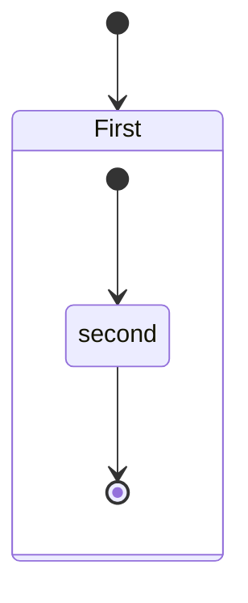

 
# CVScoringSystem
Implementation of Common Vulnerability Scoring System

## Example of Vulnarabillity report

# Report

# 4.3 Identity Management Testing
## A01:2021 – Broken Access Control
## Identity is stored in a cookie as a simple integer value, very easy to predict and manipulate.

**Base score:** 8.7
**Temporal score:** 8.7
**Environment score:** 8.7

# Overall rating

@startuml
Bob -[#red]> Alice : hello
Alice -[#0000FF]->Bob : ok
@enduml

# Base rating

### **CVSS 3.1 vector**
CVSS:3.1/AV:N/AC:H/PR:N/UI:N/S:C/C:H/I:H/A:N/E:X/RL:X/RC:X/CR:X/IR:X/AR:X/MAV:X/MAC:X/MPR:X/MUI:X/MS:X/MC:X/MI:X/MA:X # 4.7 Input Validation Testing
## A03:2021-Injection - Posting messages in chat
## When a user posts a message in the chat there is a possibility to inject malicious code.

**Base score:** 4.2
**Temporal score:** 4.2
**Environment score:** 4.2

# Overall rating

# Base rating

### **CVSS 3.1 vector**
CVSS:3.1/AV:N/AC:H/PR:L/UI:N/S:U/C:L/I:L/A:N/E:X/RL:X/RC:X/CR:X/IR:X/AR:X/MAV:X/MAC:X/MPR:X/MUI:X/MS:X/MC:X/MI:X/MA:X

### Note that CVSS Measures Severity, not Risk